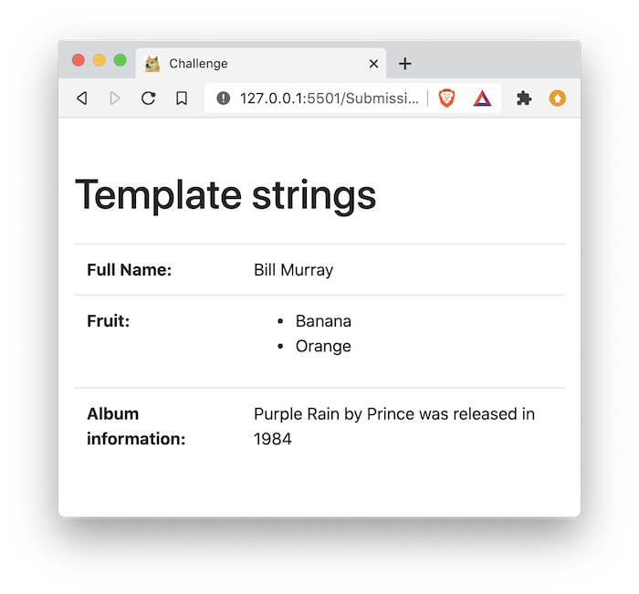

# 01 Exercise - JavaScript Template Strings

## Brief

Use JavaScript template strings to read from variables and create new strings



## Rationale

Using template strings are a quick and easy way to dynamically read from variables to create new strings.

---

## Getting Started

1. `clone` the exercise repository to your local computer.
2. The code for this exercise should go into `/Submission/static/js/script.js`.

<details>
  <summary>
   Running Automated Tests
  </summary>
  <br>

This exercise has automated tests that check your work for correctness. This is similar to how freeCodeCamp tests your code before you can proceed to the next exercise.

These tests will be run when you submit your work.

**Install dependencies needed to run tests**

To start the tests, open your terminal in VS Code for this exercise, and type the following:

```bash
npm install
```

You only have to do this once.

**Starting the tests and keeping them running**

You can have the tests running as you write your code. Every time you save your `script.js` file, the tests will rerun. It will be your job to make the tests pass, one by one. To start the tests in watch mode, type the following into your terminal:

```bash
npm run test:watch
```

To stop the tests, type `control` + `c` in your terminal.

Watch this [example video of running tests](https://vimeo.com/440650789/c09e688f9b) to see how it works

**Running the tests on-demand**

If you want to run the tests on-demand, you can type the following into your terminal:

```bash
npm test
```

</details>

## Instructions

1. Open `Submission/index.html` in your browser with Live Server, and `Submission/static/js/script.js` in VS Code.
2. Follow the instructions in `Submission/static/js/script.js` to complete the variables using template strings

---

# Submit your Exercise

- [ ] Commits are pushed to GitHub
- [ ] Automated tests are passing in GitHub

---

<details>
  <summary>
    Git CLI Refresher
  </summary>

If you need help remembering what commands to type with `git`, use the following as a reference, or watch the [git walkthrough tutorial video](https://vimeo.com/433825571/bc1830fb90)

```shell
# when ready to commit and push
git add .

git commit -m "Completed Part A"

git push origin master
```

</details>

# Walkthrough Video
[video](https://www.loom.com/share/63b56770adca4bcea94d82d442359a91)
